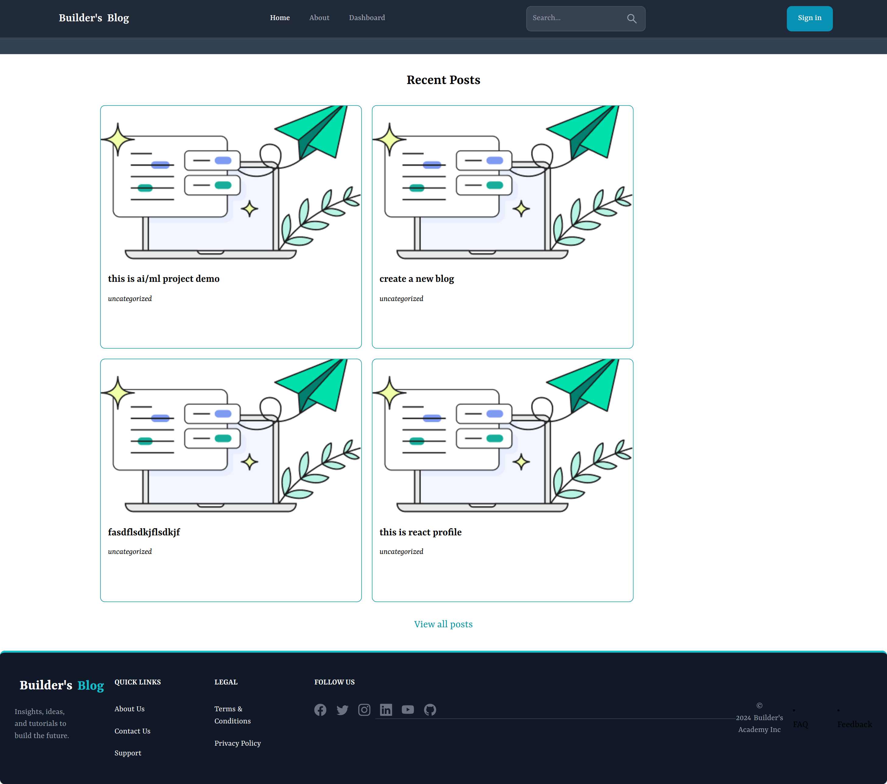
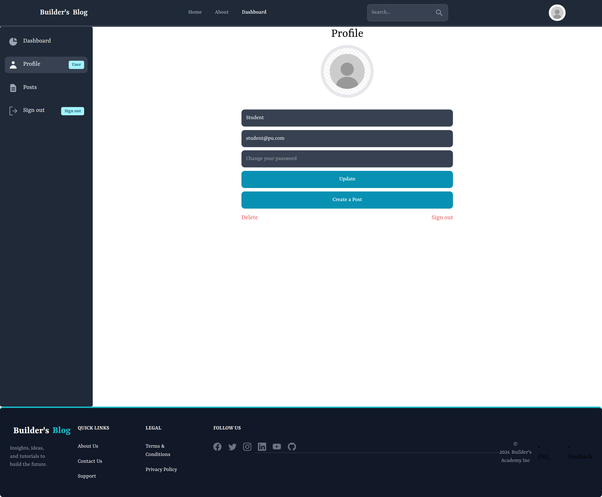
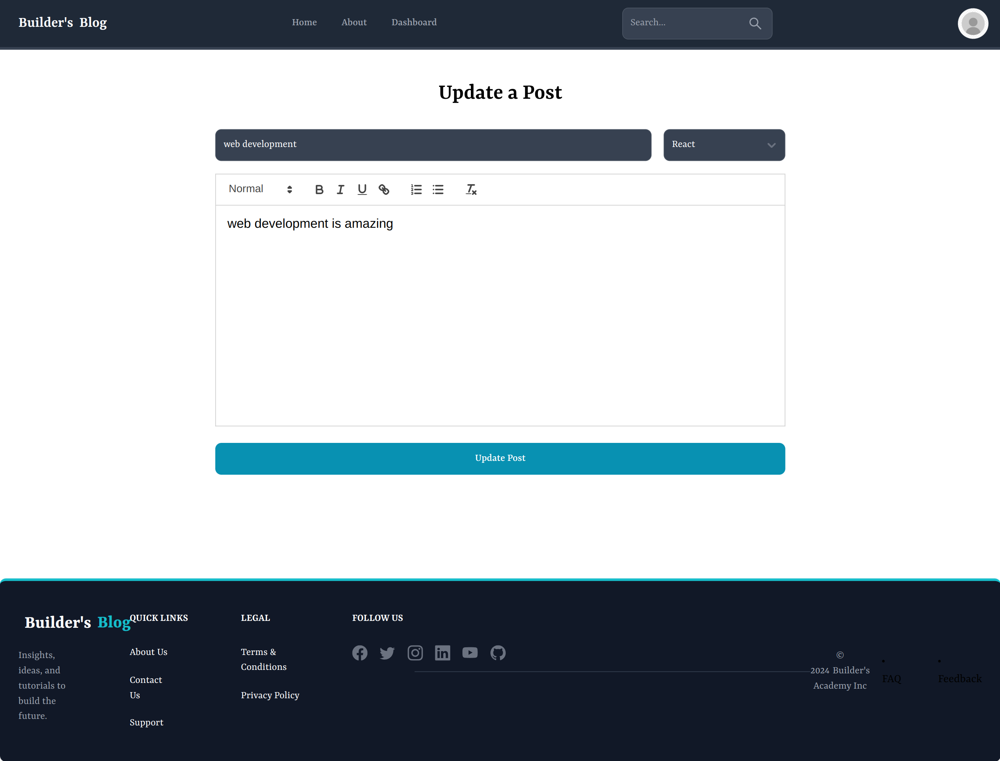
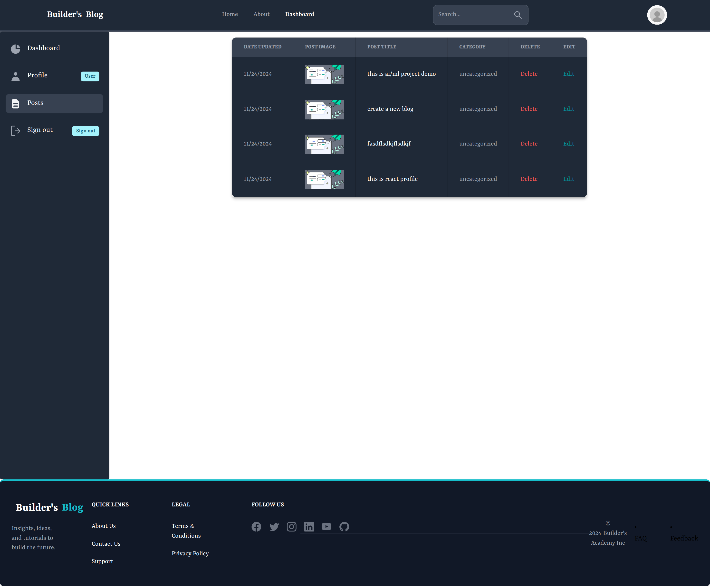
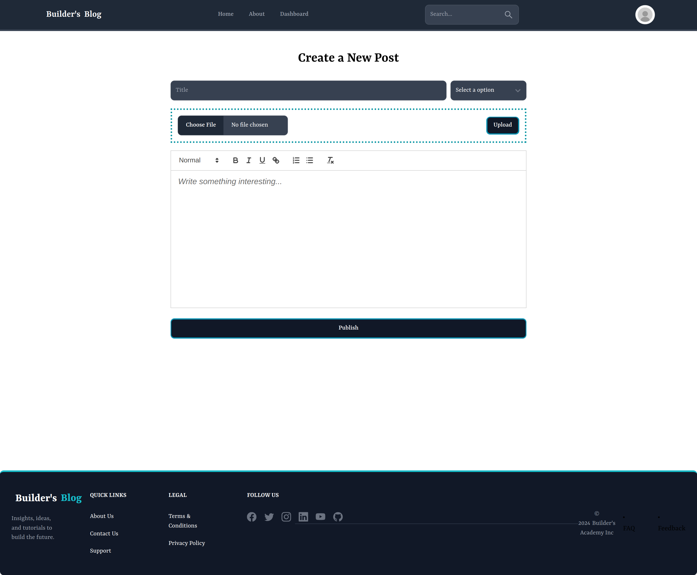
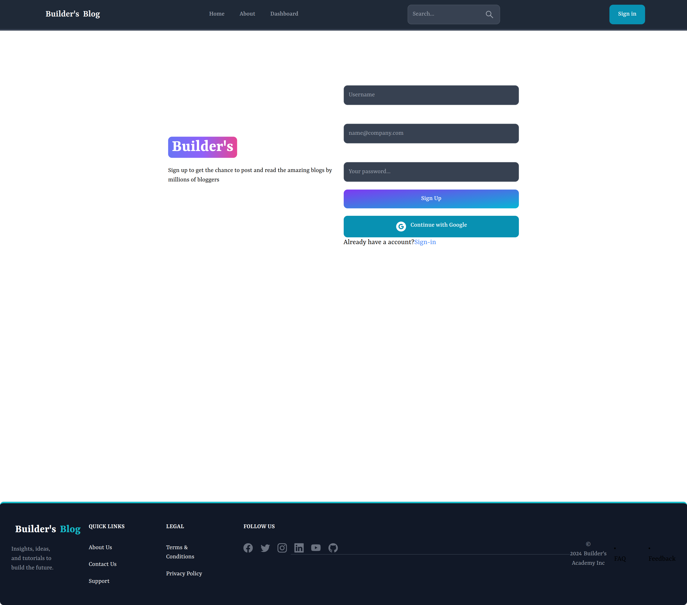

# Project Name
BlogApp project in MERN stack 

## Table of Contents
- [About the Project](#about-the-project)
- [Features](#features)
- [Installation](#installation)
- [Usage](#usage)
- [Contributing](#contributing)
- [License](#license)


## About the Project
This project is a [React-based blog website](#) designed to share articles across categories.


## Features
- User authentication
- Create, edit, and delete blog posts
- Responsive design


## Installation
1. Clone the repository:
   ```bash
   git clone https://github.com/KHATRIRAMESH/Builders.git
      ```
2. Navigate to the project directory:
   ```bash
   cd repository-name
   ```
3. Install dependencies:
   ```bash
   npm install
   ```
4. Start the development server:
   ```bash
   npm start
   ```

## Usage
- Run the application:
  ```bashlocalhost_5173_sign-in
  npm start
  ```
- Open the application in your browser at `http://localhost:3000`.
- Follow the interface to create and manage posts.


## Gallery
Home page

Article page

Sign-in page

Profile page

Update page

Dashboard post page

Create Article page

Signup page


## Contributing
Contributions are welcome! Follow these steps:
1. Fork the repository.
2. Create a feature branch (`git checkout -b feature-name`).
3. Commit your changes (`git commit -m 'Add feature-name'`).
4. Push to the branch (`git push origin feature-name`).
5. Open a pull request.


## License
Distributed under the MIT License. See `LICENSE` for more information.


## Contact
Your Name - [Email](mailto:your-email@example.com) - [LinkedIn](https://linkedin.com/in/your-profile)


## Acknowledgments
- [React](https://reactjs.org/)
- [Tailwind CSS](https://tailwindcss.com/)
- [Oauth](https://oauth.net/2/)
